

  <a href="https://enhancer-for-letterboxd.vercel.app/">
    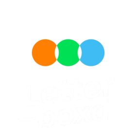
  </a>

  
  

# Enhancer for Letterboxd

Enhancer for Letterboxd is a lightweight browser extension that adds insights, filters, and tools directly into the Letterboxd UI — without getting in your way.

## Installation

- [Install for Chrome](https://chromewebstore.google.com/detail/abkbjnimmidipmhhhlcnikkifjpdjdpc)
- [Install for Firefox](https://addons.mozilla.org/firefox/addon/enhancer-for-letterboxd/)

## Features

### Ratings

- Friends ratings histogram on film pages
- Your rating histogram on cast & crew pages

  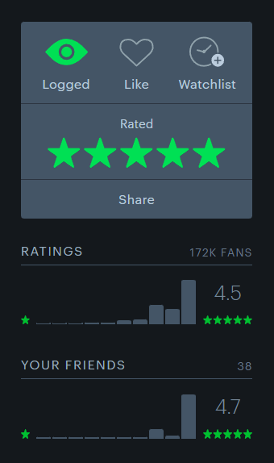
  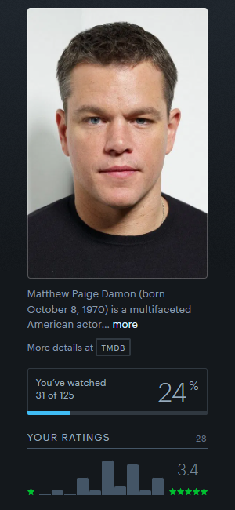
  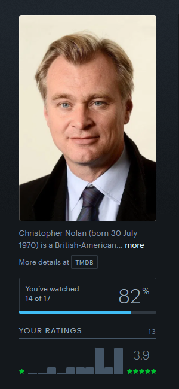

### Film stat icons

- Major awards winners ([Oscars](https://letterboxd.com/enhancerforthis/tag/oscar-winners/lists/by/oldest/), [Golden Globes](https://letterboxd.com/enhancerforthis/tag/golden-globe-winners/lists/by/oldest/), [Critics' Choice](https://letterboxd.com/enhancerforthis/tag/critics-choice-winners/lists/by/oldest/), [BAFTA winners](https://letterboxd.com/enhancerforthis/tag/bafta-winners/lists/by/oldest/), [Cannes winners](https://letterboxd.com/enhancerforthis/tag/cannes-winners/lists/by/oldest/), and [SAG winners](https://letterboxd.com/enhancerforthis/tag/sag-winners/lists/by/oldest/))
- Films in the [Criterion Collection](https://letterboxd.com/enhancerforthis/list/criterion-collection/)
- Films with a release anniversary today

  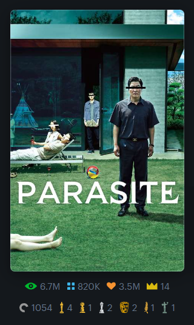
  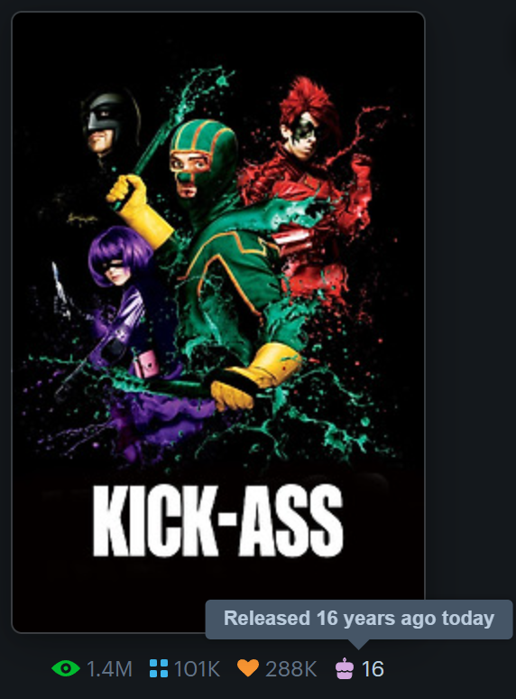

### Unofficial related films

Discover [unofficial related films](https://letterboxd.com/enhancerforthis/tag/unofficial-related/lists/by/name/) directly on film pages.

  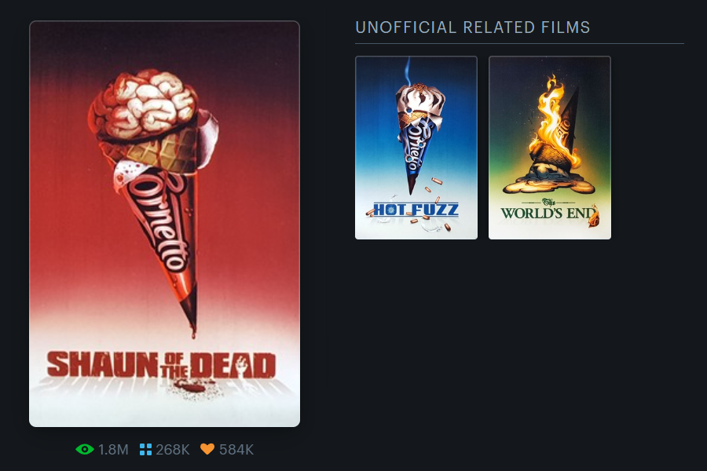

### Runtime

Choose how runtime is displayed:

- Minutes (Letterboxd default)
- Hours
- Both

### Profile activities

Additional activities directly on profiles:

- Recent likes
- Recent 5-star ratings
- Recent year premieres

  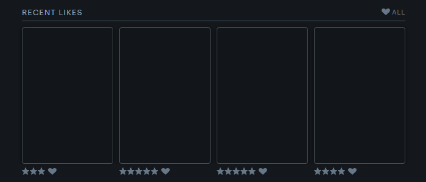

### Profile stats

Additional stats directly on profiles:

- Average films watched per month/week/day this year
- First log year
- Years logging

Option to hide native Letterboxd stats.

  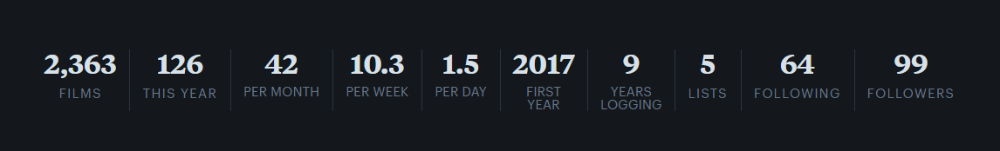

### Filters

Additional filters directly on lists:

- Country, Language, Theme, and Runtime (beta)
- "Hide shorts, TV and docs" shortcut

Option to hide native Letterboxd filters.

  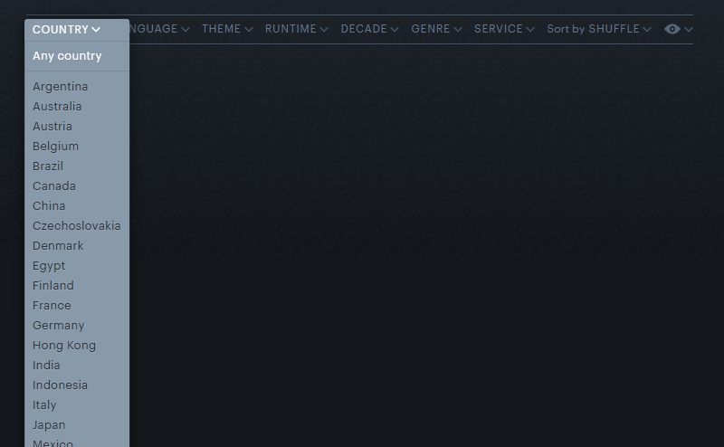

### Find twins

Find members who share your four favorite films.

  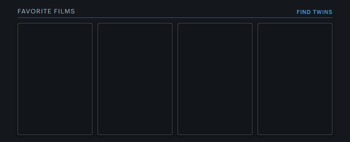

### Writing tools

Formatting toolbar with live preview.

  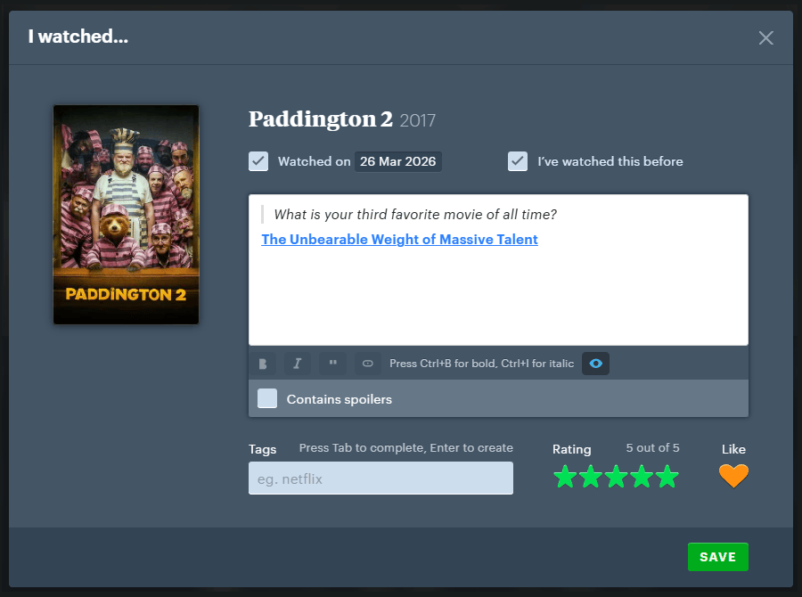

### Random film picker

Pick a random film from watchlist, lists, and cast & crew pages.

  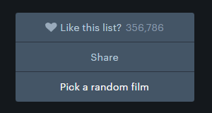

### Settings

Enable or disable all features from the extension popup.

  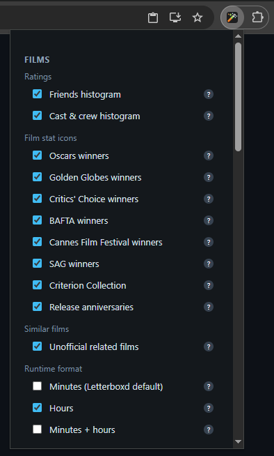

## Support

- Found a bug or have a suggestion? [Report it here](https://github.com/leandcesar/enhancer-for-letterboxd/issues?q=is%3Aissue)
- Want to see what’s new? [Check out the releases](https://github.com/leandcesar/enhancer-for-letterboxd/releases)
- Enjoying the extension? [Support the project](https://buymeacoffee.com/leandcesar)
