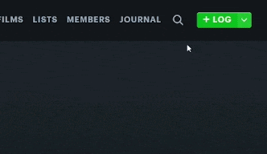
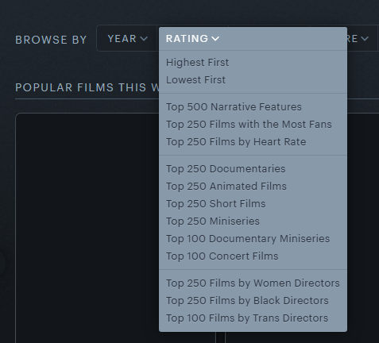

  

  
  

# Enhancer for Letterboxd

Enhancer for Letterboxd is a lightweight browser extension that adds insights, filters, and tools directly into the Letterboxd UI — without getting in your way.

## Installation

- [Install for Chrome](https://chromewebstore.google.com/detail/abkbjnimmidipmhhhlcnikkifjpdjdpc)
- [Install for Firefox](https://addons.mozilla.org/firefox/addon/enhancer-for-letterboxd/)

## Features

### Ratings histogram

Friends' ratings histogram on film pages and your rating histogram on cast & crew pages. Option to hide native Letterboxd ratings histogram.

  
  
  

### Film stat icons

Major awards winners ([Oscars](https://letterboxd.com/enhancerforthis/tag/oscar-winners/lists/by/oldest/), [Golden Globes](https://letterboxd.com/enhancerforthis/tag/golden-globe-winners/lists/by/oldest/), [Critics' Choice](https://letterboxd.com/enhancerforthis/tag/critics-choice-winners/lists/by/oldest/), [BAFTA](https://letterboxd.com/enhancerforthis/tag/bafta-winners/lists/by/oldest/), [Cannes](https://letterboxd.com/enhancerforthis/tag/cannes-winners/lists/by/oldest/), and [SAG](https://letterboxd.com/enhancerforthis/tag/sag-winners/lists/by/oldest/)), films in the [Criterion Collection](https://letterboxd.com/enhancerforthis/list/criterion-collection/), and films with a release anniversary today.

  
  

### Search autocomplete

Shows instant film suggestions while typing in the search bar.

  

### Text editor toolbar

Formatting toolbar for applying bold, italic, quotes, hyperlinks, with preview.

  

### Filters

Additional filters directly on lists: Country, Language, Theme, and Runtime (beta). "Hide shorts, TV and docs" shortcut. Option to hide native Letterboxd filters.

  

### Profile stats

Additional stats directly on profiles: Average films watched per month/week/day this year, First log year, and Years logging. Option to hide native Letterboxd stats.

  

### Profile activities

Additional activities directly on profiles: Recent likes, Recent 5-star ratings, and Recent year premieres.

  

### Find twins

Find members who share the same four favorite films.

  

### Random film picker

Pick a random film from watchlist, lists, and cast & crew pages.

  

### Expanded "Browse by rating"

Adds more official lists to the "Rating" filter on the [Films page](https://letterboxd.com/films/).

  

### Unofficial related films

Discover [unofficial related films](https://letterboxd.com/enhancerforthis/tag/unofficial-related/lists/by/name/) directly on film pages.

  

### Runtime

Choose how runtime is displayed:

- Minutes (Letterboxd default)
- Hours
- Both

### Settings

Enable or disable all features from the extension popup.

  

## Support

- Found a bug or have a suggestion? [Report it here](https://github.com/leandcesar/enhancer-for-letterboxd/issues?q=is%3Aissue)
- Want to see what’s new? [Check out the releases](https://github.com/leandcesar/enhancer-for-letterboxd/releases)
- Enjoying the extension? [Support the project](https://buymeacoffee.com/leandcesar)
